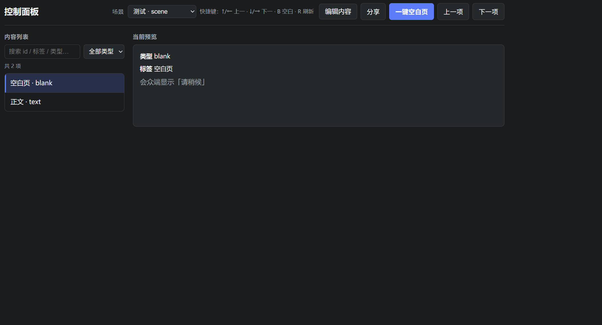
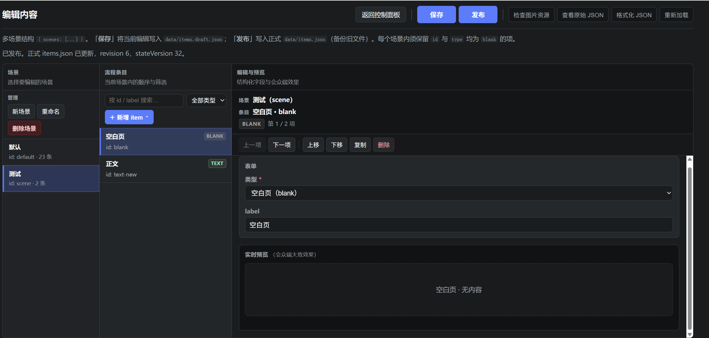

# Live sync (minimal demo)

轻量「控制端 + 会众端」同步展示：Node.js + Express，会众端轮询更新，无数据库；**可选口令**保护控制端与编辑端页面及对应 API（见下「口令与 API 鉴权」）。支持**多场景（scene）**：同一服务内多套内容（例如不同活动环节、分段流程），控制端切换场景，会众端仅跟随当前场景的当前条目。

## 应用场景与作用

**作用**：在一处集中编排展示内容（提示语、段落文字、配图等），操作员按流程切换「当前条目」，观众侧的手机或浏览器大屏同步显示**同一时刻**的画面，无需安装独立客户端,无需投影仪。适合「一人控场、多人观看」的提词、提示与简单幻灯式展示。

**典型场景**：

- **会议与活动**：主持人或场控按议程切换提示页与图片，观众席用手机或副屏跟随当前页。
- **教学与培训**：课堂或工作坊中，讲师侧控制展示节奏，学员设备只读同步，减少来回传递文件。
- **多段流程**：用「场景」区分上半场与下半场、不同模块或备用流程；控制端切换场景后，观看端只呈现当前场景下的条目序列。
- **彩排与发布分离**：在编辑端准备与修改草稿，确认后再发布；现场由控制端切换，降低临场改稿带来的混乱。

**定位说明**：本项目刻意保持轻量（无数据库、部署简单），适用于局域网或临时组网；若需复杂权限、强审计或高并发，应在此基础上自行扩展或选用更重的方案。

## 要求

- Node.js 18 或更高

## 安装与启动

### 首次克隆：准备 `data/items.json`

**新克隆的仓库默认没有该文件**，直接启动会因无法读取目录而失败。请先至少将 **`data/examples/items.sample.json` 复制为 `data/items.json`**（步骤与可选文件见 **`data/examples/README.md`**）。

可选：将 `state.sample.json`、`catalog-meta.sample.json` 复制为 `data/state.json`、`data/catalog-meta.json`，使初始状态与示例一致。

```bash
npm install
npm start
```

默认监听端口为 **3002**（环境变量 **`PORT`** 可覆盖）。

## 访问地址

（以下示例：`http://localhost:3002/...`，端口以控制台输出为准。）

| 页面 | URL |
|------|-----|
| 会众端（手机竖屏优先） | `/view` |
| 控制端 | `/admin` |
| 内容编辑（多场景、三栏、搜索/筛选、实时预览、图片上传至 `public/media`、草稿 `data/items.draft.json`） | `/editor` |

## 运行截图

资源文件位于仓库目录 **`screenshot/`**。

### 会众端 `/view`


### 控制端 `/admin`



### 编辑端 `/editor`



## 口令与 API 鉴权（可选）

环境变量见 **`.env.example`**（复制为 `.env` 后填写）。

- **未设置 `ADMIN_PASSWORD` 与 `EDITOR_PASSWORD`（及兼容旧名）时**：不启用页面与 API 口令（与早期行为一致）。
- **设置 `ADMIN_PASSWORD` 后**：访问 **`/admin`** 及控制端相关 API 需已登录（经 **`/login`** 表单或 **`POST /api/auth/login`** 取得 `worship_admin` Cookie）：**`GET /api/scenes`**、**`GET /api/items`**、**`POST /api/scene`**、**`GET /api/share/view-url`**、**`GET /api/share/qrcode.png`**。
- **`EDITOR_PASSWORD`**：若留空则与 **`ADMIN_PASSWORD`** 相同。设置后 **`/editor`** 及草稿/保存/发布/上传 API 需编辑端 Cookie（`worship_editor`）：**`GET /api/items/draft`**、**`PUT /api/items`**、**`POST /api/items/publish`**、**`POST /api/editor/upload-media`**。
- **始终不鉴权**：**`GET /view`**、**`GET /api/state`**、**`POST /api/state`**（会众端轮询与切页）。自动化或脚本在启用口令后调用管理类接口时，需先 **`POST /api/auth/login`**（JSON：`{ "role": "admin" | "editor", "password": "..." }`）并携带返回的 Cookie。

## 部署与安全

- **`WORSHIP_AUTH_SECRET`**：Cookie 签名密钥。未设置时使用代码内占位值，**仅适合本机调试**；生产环境务必改为**随机长字符串**（见 `.env.example`）。
- **`POST /api/state`** 可切换当前展示条目，**无登录校验**，适合局域网或投影机等可信场景。若服务暴露到公网或不可信网络，请用防火墙、反向代理或 VPN 等自行约束访问。

### 分享会众端链接（二维码）

在 `.env` 中设置 **`PUBLIC_VIEW_URL`** 为会众端的**完整 URL**（须与手机浏览器实际访问一致；HTTPS 站点请写 `https://.../view`），例如：

`PUBLIC_VIEW_URL=http://192.168.1.100:3002/view`

重启服务后，在 **控制端** 点击 **「分享」** 可显示该链接的二维码，便于手机扫码打开会众端。未配置时点击「分享」会提示先设置环境变量。

## 示例图片与编辑器上传

- **编辑器**：在 `/editor` 中编辑 **image** 类型条目时，可用 **「选择图片」** 上传；文件保存到 `public/media/`，条目 `src` 一般为 `/media/文件名`（见 `CHANGELOG` 中「图片条目与上传」）。
- **手动放置**：也可将文件直接放入 `public/media/`，在条目 `src` 中填写对应 URL，例如：

  - `public/media/song1-part1.jpg` → 浏览器访问 `/media/song1-part1.jpg`

若路径指向的文件不存在，会众端会显示占位提示，不会崩溃。

## 数据

- **示例（给克隆仓库的人参考）**：`data/examples/` 内含 **`items.sample.json`**（多场景）、**`items.legacy.sample.json`**（旧版仅 `items` 数组）、以及 **`state.sample.json`**、**`catalog-meta.sample.json`** 的结构示例；说明与如何复制到 `data/` 见 **`data/examples/README.md`**。示例图片路径 **`/media/example.svg`** 对应仓库中的 **`public/media/example.svg`**。
- **正式目录**：`data/items.json`，根结构为 `{ "scenes": [ { "id", "name", "items": [...] } ] }`。每个 `items` 数组与旧版单表含义相同（含一条 `blank` 等规则），但 **item `id` 仅在同一 scene 内唯一**。
- **编辑文件**：`data/items.draft.json`，结构与正式一致；在 **/editor** 中点「**保存**」写入；「**发布**」覆盖正式 `items.json` 并备份（见 `CHANGELOG.md`）。
- **编辑器界面**：三栏（场景 / 条目 / 编辑与预览）、条目搜索与类型筛选、会众端近似实时预览、条目 **`id` 在表单中隐藏**（自动生成）、类型下拉为中文说明；**图片类型**支持本地上传（`POST /api/editor/upload-media`）或手填 `src` 路径。详情见 **`CHANGELOG.md`**。
- **旧数据**：若仅有 `{ "items": [...] }`（无 `scenes`），服务读入时会**自动**升为单场景（`default` /「默认」）。详情见 **`CHANGELOG.md`** 顶部「多场景（scene）支持」一节。
- **运行状态**：`data/state.json` 含 `sceneId`、`activeId`、`stateVersion` 等；持久化当前场景与当前条目，重启后恢复（若条目不存在则回退 blank 或该场景首项）。

### API 摘要（详见 `server.js` 注释与 CHANGELOG）

设口令后，下列接口的鉴权见上文「口令与 API 鉴权」。

| 说明 | 方法 | 路径 |
|------|------|------|
| 登录状态（是否需要口令、当前是否已登录） | GET | `/api/auth/status` |
| JSON 登录（`body` 中 `role` 为 `admin` 或 `editor`，含 `password`） | POST | `/api/auth/login` |
| 登出（`body` 中 `role` 为 `admin` 或 `editor`） | POST | `/api/auth/logout` |
| 会众端状态（含 `sceneId`、`item`、`nextItem`） | GET | `/api/state` |
| 切换当前条目 | POST | `/api/state`（body `{ "id" }`） |
| 场景列表 | GET | `/api/scenes` |
| 切换场景 | POST | `/api/scene`（body `{ "sceneId" }`） |
| 当前场景正式条目 | GET | `/api/items` |
| 草稿目录（全场景） | GET | `/api/items/draft` |
| 保存草稿 | PUT | `/api/items` |
| 发布正式目录 | POST | `/api/items/publish` |
| 分享链接是否已配置 | GET | `/api/share/view-url` |
| 分享二维码 PNG | GET | `/api/share/qrcode.png` |
| 编辑器上传图片（multipart 字段名 `file`） | POST | `/api/editor/upload-media` |

